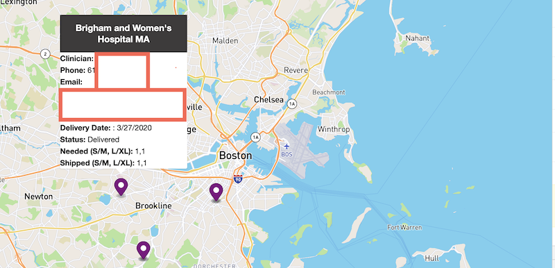

## 3DC Field UI

To open on `http://localhost 8000`:

```bash
$ make
```

To format:

```bash
$ make format
```

Requires:

- Python3 (or equivalent, to serve the page)
- [prettier](https://prettier.io/) (if formatting)

Uses:

- [Mapbox GL JS](https://docs.mapbox.com/mapbox-gl-js/api/)
- [Google Sheets API](https://developers.google.com/sheets/api)
- [Google Geocoding API](https://developers.google.com/maps/documentation/javascript/geocoding)

Looks like:


